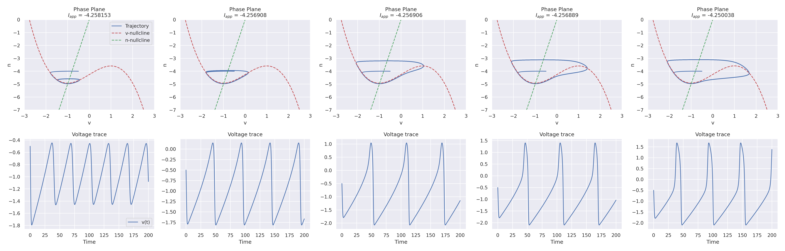
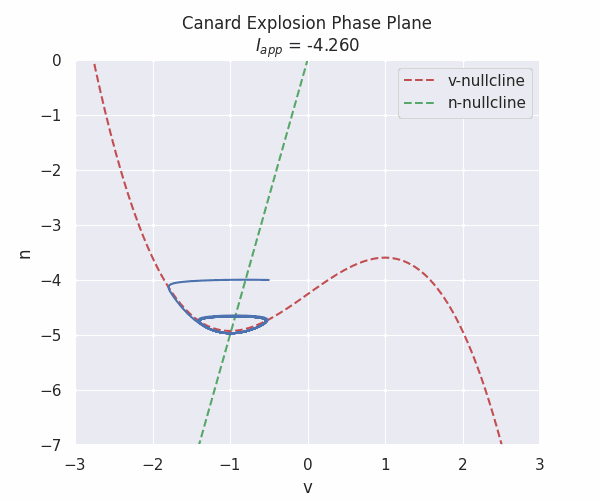

# CanardExplosionResearch_CompNeuroScience_CSM

Colton Koenig and Daniel Krawciw

## Our Goals

We are researching Canard Explosions in our Computational Neuroscience class final project. This Repository contains tests and functions for our results.

1. Have functions/files together to compute solutions to 2D Reduced HH and FH-N models that include the applied current specified in Börgers

2. Work to find parameter range to make Canard Explosions

3. Obtain information on dynamics when the Neuron exhibits Canard behavior

4. Make animations for them displaying this behavior

5. Move on to work with systems of neurons exhibiting canard explosions

6. Compare original reduced HH/FH-N model parameters to system parameters

## Tests

### Compute basic 2D Reduced HH Solution to an RTM neuron

Here, we just make initial pushes to create the functions to make a plot in order to verify that basic functionality is there. We used the parameters from page 32 from Börgers' textbook [1].

Here, we have a Two Dimensional reduced Hodgkin-Huxley (HH) neuron simulated.

Code for the process of making this plot can be found in [tests/HodgkinHuxley.ipynb](tests/HodgkinHuxley.ipynb)

We considered using HH for our project, however, there are many parameters to manage that could convolute simulations later on.

## FitzHugh-Nagumo Model

### Introducing FHN

Ultimately, we neded up focusing on the FitzHugh-Nagumo (FHN) model as Canard Explosion's are about capturing types of neuron firing and FHN captures just that with fewer parameters than HH.

Here is an example of what numerically solved FHN neurons looks like.

### Canards in FHN

We are interested in Canard Explosions. Canard explosions are not bifurcations, but they look like abrupt changes in amplitudes for oscillations in the voltage trace as a parameter changes slightly.

FHN Equations:

$$
\begin{align*}
    \frac{dv}{dt} &= v - v^3/3 - n + I,\\
    \frac{dn}{dt} &= \frac{av - n}{\tau_n}
\end{align*}
$$

Here are some visualizations to show this behavior:

## Mixed Mode Oscillations (MMOs)

A turn in our paper, which was pointed out by Börgers, is that Canard behavior is present in MMO behavior.

We saught to illustrate well why exactly this behavior makes sense to connect here.

First, we plot a simple FHN plot with a constant applied current that is too small to continue to create action spikes.

We see that the behavior is fairly uninteresting as the voltage trace simply damps out.

Now, if we make the current grow logarithmically, we obtain the following behavior:

Here, we see that after about 150 ms, canard behavior is exposed and the neuron is making dramatic spikes every action spike.

If we reset the current after a large spike from a Canard Explosion, we can obtain MMO behavior:

This is called **Adaptive Current**, where the current depends on the voltage trace. At large spikes, the adaptive current resets.

## References

[1] Börgers, Christoph. An Introduction to Modeling Neuronal Dynamics Christoph Börgers. Springer International Publishing Springer, 2018.
